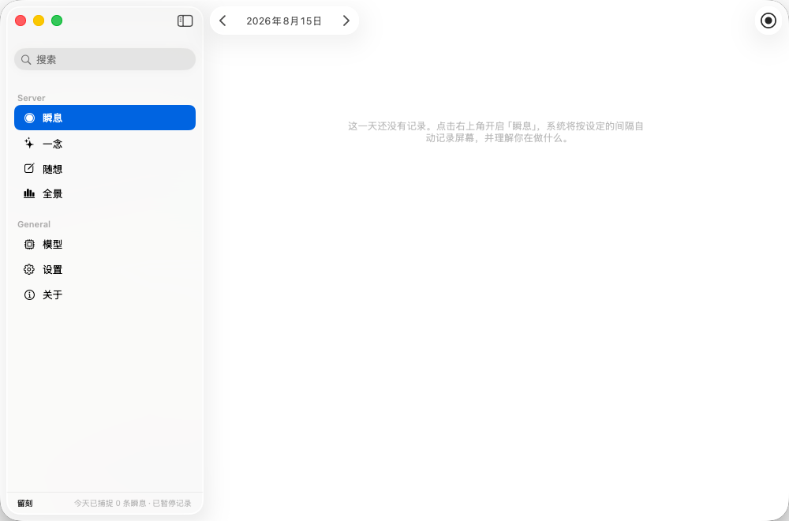
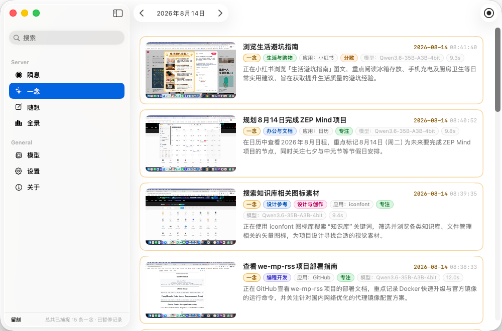
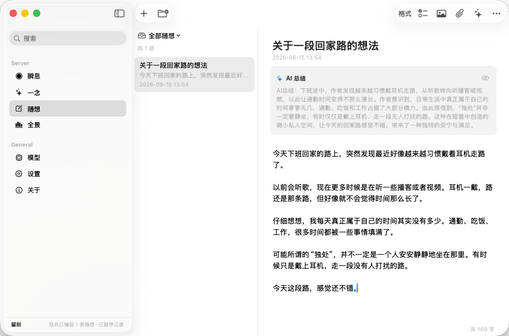
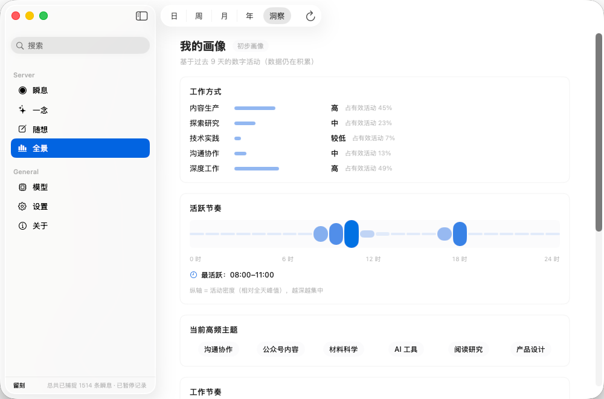

# 留刻

一个记录数字生活的 macOS 本地工具。

留刻（Memento）会按照设定的时间间隔截取屏幕，让 AI 判断你当时正在做什么，再把这些记录保存到本机。

我做它主要是因为有时候一天过去了，回头却想不起自己到底做了些什么。

所以我想把这些原本会随着时间消失的片段留下来，并做成一个可以随时回看的时间线。

> **所有数据默认保存在本机。留刻本身没有自己的云端服务器，后续可能会增加同步到iCloud的功能**

## 截图

### 瞬息

按时间倒序查看当天的记录，每条记录带有截图、标题和活动分类。



### 一念

把日常记录里那些值得再次回看的瞬间单独留下，可以看到当时的截图、分类和应用来源。



### 随想

一个独立的富文本笔记空间。

可以写长文、插入图片和链接，也可以让 AI 对整篇内容进行总结。



### 全景

从日、周、月到年，回顾自己的活动轨迹。

目前主要统计活跃时间、工作方式、高频主题等信息，这些数据直接根据本地记录计算，不调用模型。



## 功能

### 瞬息

定时截取屏幕，并使用模型分析当前活动。

每条记录会保存：

- 截图
- 活动标题
- 活动分类
- 应用来源
- 时间信息

### 一念

可以把重要的记录单独留下，方便以后再次查看。

### 随想

用于记录主动产生的想法，而不是自动产生的屏幕记录。

支持：

- 富文本编辑
- 图片
- 链接
- AI 总结、润色

### 全景

对已经产生的记录进行本地聚合，目前支持：

- 日
- 周
- 月
- 年
- 洞察

可以从不同时间尺度查看自己的活动情况。

### 状态栏

留刻常驻 macOS 状态栏，可以直接：

- 查看当天记录
- 开始 / 停止录制
- 修改设置
- 打开留刻

## AI

留刻支持两种方式：

**在线模型**

可以配置第三方模型 API，让模型分析截图。

**本地模型**

也可以接入本机运行的视觉模型。

如果使用本地模型，截图分析过程可以完全在自己的电脑上完成。

目前活动分为九类：

- 办公与文档
- 沟通与协作
- 阅读与研究
- 编程开发
- 设计创作
- 影音娱乐
- 生活购物
- 系统工具
- 待机离席

## 工作方式

整个过程其实比较简单：

```text
定时截屏
   ↓
模型分析当前画面
   ↓
生成活动记录
   ↓
保存到本机
   ↓
在「瞬息」「一念」「全景」中回看
```

留刻不会持续录制视频，而是按照设定的时间间隔保存屏幕截图。

截图间隔可以在设置中调整。

## 隐私

留刻从一开始就是按照本地存储来设计的。

留刻本身：

- 不提供云端数据存储
- 不要求登录账号
- 不建立用户数据中心
- 不会把数据上传到留刻自己的服务器
- 截图和分析结果默认保存在本机
- 「全景」的数据统计在本地完成

不过，如果你使用在线模型 API，截图需要发送给你配置的模型服务商进行分析。

因此，使用在线模型时，需要根据对应服务商的隐私政策判断数据如何被处理。

如果比较在意这一点，可以使用本地运行的视觉模型。

## 数据存储

所有记录都以文件形式保存在本机。

截图和日志：

```text
~/Documents/留刻/截图日志/
└── YYYY-MM/
    └── screenshots/
        └── YYYY-MM-DD/
            ├── 2026-08-15-120000.jpg
            ├── 2026-08-15-120000.json
            ├── 2026-08-15-120500.jpg
            └── 2026-08-15-120500.json
```

每条记录由一张 JPG 截图和一个同名 JSON 文件组成。

JSON 保存模型返回的结构化信息。

### 配置

```text
~/Library/Application Support/留刻/config.json
```

主要包含：

- 模型
- API 地址
- API Key
- 截屏间隔
- 数据保留规则

### 运行日志

```text
~/Library/Application Support/留刻/lens.log
```

## 配置文件

模型相关配置写在：

```text
~/Library/Application Support/留刻/config.json
```

目前 API Key 以明文形式保存在这个文件中。

这是目前有意保留的设计。使用钥匙串等方式保存 Key 后，在应用签名发生变化时可能会触发 macOS 的额外授权提示，对于目前这个主要自己使用的项目来说反而比较麻烦。

所以现在选择了比较简单的方式：配置文件就在自己的电脑上，由使用者自己保管。

**不要把包含 API Key 的 `config.json` 提交到 Git 仓库。**

## 构建

留刻使用 Swift Package。

需要先安装 Xcode Command Line Tools。

### 编译

在仓库根目录（clone 后文件夹名为 `Memento`，你本地是 `留刻/Memento`）执行：

```bash
swift build -c release --disable-sandbox
```

### 构建 App

仓库里提供了 `build-app.sh`：

```bash
bash build-app.sh
```

脚本会：

1. 编译 Release 版本
2. 将资源复制到 App Bundle
3. 执行 ad-hoc 签名
4. 对资源进行自检

最终生成：

```text
留刻.app
```

可以直接运行：

```bash
open 留刻.app
```

当前版本：**1.0.3**

> **v1.0.2 更新：** 重构「全景」专注度算法——以 **AI 专注提示** 为核心指标（权重 60%），有效时间投入与活动连续性各占 15%，并把原「干扰 / 切换」改为正向的「任务稳定性」（10%，无干扰 / 切换时接近满分）。持续专注时专注度不再随记录增多而无故下降；同时修复了状态栏速览面板的专注度数值与全景页不一致的问题。

> **v1.0.3 更新：** 修复「瞬息」页面不能自动跳回今天的问题——选过历史日期后切走再切回，或跨午夜 / 打开时仍显示昨天，现在都会自动回到当天。

## 系统要求

- macOS 26 或更高版本
- Apple Silicon 或 Intel Mac
- 「屏幕录制」权限

第一次启动时，需要在：

**系统设置 → 隐私与安全性 → 屏幕录制**

中允许留刻访问屏幕。

如果没有这个权限，留刻无法正常截取屏幕。

## 数据保留

留刻支持设置数据保留规则。

可以根据自己的需求清理历史截图，同时保留对应的 JSON 数据。

具体配置保存在：

```text
~/Library/Application Support/留刻/config.json
```

## 开发注意事项

### Bundle ID

打包使用的 Bundle ID 固定为：

```text
app.memento.lens
```

请不要修改。

macOS 的「屏幕录制」权限与应用身份相关。修改 Bundle ID 后，系统可能会把它当成一个新的应用，需要重新授权屏幕录制权限。

## 许可证

目前仓库暂未添加 `LICENSE`。

代码虽然公开，但目前不代表授予自由复制、修改、分发或商业使用的权利。

如果希望基于这个项目进行商业使用、二次开发或其他用途，请先联系我。

## 从 Releases 安装

在 GitHub Releases 页面下载 `留刻-1.0.3.dmg`，拖入「应用程序」即可。

本应用目前使用 ad-hoc 签名，不是 Apple 开发者签名。下载后第一次打开，macOS 可能会拦截：

- 右键点击「留刻」→ 选择「打开」，在弹出提示中点「打开」即可；
- 或在终端执行：

```bash
xattr -dr com.apple.quarantine /Applications/留刻.app
```

执行一次之后就能正常从启动台打开，不会再被拦。

源码也可以用 `bash build-app.sh` 自行打包，脚本会同时生成 `留刻-1.0.3.dmg`。

## 关于

留刻是我自己做的一个 macOS 项目。

它最开始只是一个很简单的想法：**想知道自己一天到底把时间花在哪里了。**

后来慢慢加入了 AI 活动识别、时间线、重要记录、随想和全景统计。

现在还在持续开发。

如果你发现 Bug，或者有比较好的想法，欢迎提交 Issue 或 Pull Request。
